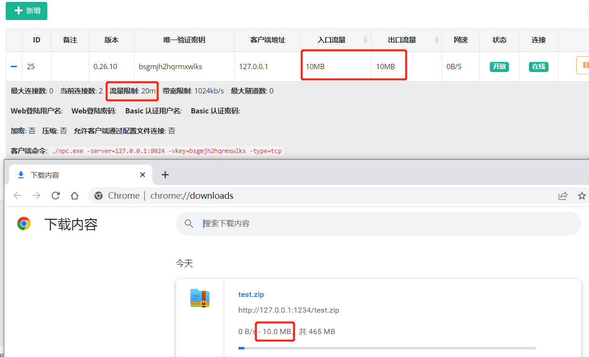

# NPS

# 说明
由于nps已经有二年多的时间没有更新了，存留了不少bug和未完善的功能。

此版本基于 nps 0.26.10的基础上二次开发而来。


## 更新日志  
- 2024-06-01  v0.26.19  
  - golang 版本升级到 1.22.
  - 增加自动https，自动将http 重定向（301）到 https.  
  - 客户端命令行方式启动支持多个隧道ID，使用逗号拼接，示例：`npc -server=xxx:8024 -vkey=ytkpyr0er676m0r7,iwnbjfbvygvzyzzt` .
  - 移除 nps.conf 参数 `https_just_proxy` , 调整 https 处理逻辑，如果上传了 https 证书，则由nps负责SSL (此方式可以获取真实IP)，
      否则走端口转发模式（使用本地证书,nps 获取不到真实IP）， 如下图所示。    

- 2024-02-27  v0.26.18  
  ***新增***：nps.conf 新增 `tls_bridge_port=8025` 参数，当 `tls_enable=true` 时，nps 会监听8025端口，作为 tls 的连接端口。  
             客户端可以选择连接 tls 端口或者非 tls 端口： `npc.exe  -server=xxx:8024 -vkey=xxx` 或 `npc.exe  -server=xxx:8025 -vkey=xxx -tls_enable=true`
  
  
- 2024-01-31  v0.26.17  
  ***说明***：考虑到 npc 历史版本客户端众多，版本号不同旧版本客户端无法连接，为了兼容，仓库版本号将继续沿用 0.26.xx


- 2024-01-02  v0.27.01  (已作废，功能移动到v0.26.17 版本)  
  ***新增***：tls 流量加密，(客户端忽略证书校验，谨慎使用，客户端与服务端需要同时开启，或同时关闭)，使用方式：   
             服务端：nps.conf `tls_enable=true`;    
             客户端：npc.conf `tls_enable=true` 或者 `npc.exe  -server=xxx -vkey=xxx -tls_enable=true`  

  
- 2023-06-01  v0.26.16  
  ***修复***：https 流量不统计 Bug 修复。  
  ***新增***：新增全局黑名单IP，用于防止被肉鸡扫描端口或被恶意攻击。  
  ***新增***：新增客户端上次在线时间。


- 2023-02-24  v0.26.15  
  ***修复***：更新程序 url 更改到当前仓库中   
  ***修复***：nps 在外部路径启动时找不到配置文件  
  ***新增***：增加 nps 启动参数，`-conf_path=D:\test\nps`,可用于加载指定nps配置文件和web文件目录。  
  ***window 使用示例：***  
  直接启动：`nps.exe -conf_path=D:\test\nps`  
  安装：`nps.exe install -conf_path=D:\test\nps`    
  安装启动：`nps.exe start`      

  ***linux 使用示例：***    
  直接启动：`./nps -conf_path=/app/nps`  
  安装：`./nps install -conf_path=/app/nps`  
  安装启动：`nps start -conf_path=/app/nps`  


- 2022-12-30  v0.26.14  
  ***修复***：API 鉴权漏洞修复


- 2022-12-19  
***修复***：某些场景下丢包导致服务端意外退出  
***优化***：新增隧道时，不指定服务端口时，将自动生成端口号  
***优化***：API返回ID, `/client/add/, /index/addhost/，/index/add/ `   
***优化***：域名解析、隧道页面，增加[唯一验证密钥]，方便搜查  


- 2022-10-30   
***新增***：在管理面板中新增客户端时，可以配置多个黑名单IP，用于防止被肉鸡扫描端口或被恶意攻击。  
***优化***：0.26.12 版本还原了注册系统功能，使用方式和以前一样。无论是否注册了系统服务，直接执行 nps 时只会读取当前目录下的配置文件。


- 2022-10-27  
***新增***：在管理面板登录时开启验证码校验，开启方式：nps.conf `open_captcha=true`，感谢 [@dongFangTuring](https://github.com/dongFangTuring) 提供的PR  

  
- 2022-10-24:     
***修复***：HTTP协议支持WebSocket(稳定性待测试)
  

- 2022-10-21:   
***修复***：HTTP协议下实时统计流量，能够精准的限制住流量（上下行对等）  
***优化***：删除HTTP隧道时，客户端已用流量不再清空


- 2022-10-19:  
***BUG***：在TCP协议下，流量统计有问题，只有当连接断开时才会统计流量。例如，限制客户端流量20m,当传输100m的文件时，也能传输成功。  
***修复***：TCP协议下实时统计流量，能够精准的限制住流量（上下行对等）  
***优化***：删除TCP隧道时，客户端已用流量不再清空



- 2022-09-14:  
修改NPS工作目录为当前可执行文件目录（即配置文件和nps可执行文件放在同一目录下，直接执行nps文件即可），去除注册系统服务，启动、停止、升级等命令


下载对应的系统版本即可，服务端和客户端是单独的

### 服务端启动
下载完服务器压缩包后，解压，然后进入解压后的文件夹

- 执行安装命令

对于linux|darwin ```sudo ./nps install```

对于windows，管理员身份运行cmd，进入安装目录 ```nps.exe install```

- 默认端口

nps默认配置文件使用了80，443，8080，8024端口

80与443端口为域名解析模式默认端口

8080为web管理访问端口

8024为网桥端口，用于客户端与服务器通信

- 启动

对于linux|darwin ```sudo nps start```

对于windows，管理员身份运行cmd，进入程序目录 ```nps.exe start```

```安装后windows配置文件位于 C:\Program Files\nps，linux和darwin位于/etc/nps```

**如果发现没有启动成功，可以查看日志(Windows日志文件位于当前运行目录下，linux和darwin位于/var/log/nps.log)**
- 访问服务端ip:web服务端口（默认为8080）
- 使用用户名和密码登陆（默认admin/123，正式使用一定要更改）
- 创建客户端

### 客户端连接
- 点击web管理中客户端前的+号，复制启动命令
- 执行启动命令，linux直接执行即可，windows将./npc换成npc.exe用cmd执行

如果需要注册到系统服务可查看[注册到系统服务](https://ehang-io.github.io/nps/#/use?id=注册到系统服务)

### 配置
- 客户端连接后，在web中配置对应穿透服务即可
- 更多高级用法见[完整文档](https://ehang-io.github.io/nps/)

## 贡献
- 如果遇到bug可以直接提交至dev分支
- 使用遇到问题可以通过issues反馈
- 项目处于开发阶段，还有很多待完善的地方，如果可以贡献代码，请提交 PR 至 dev 分支
- 如果有新的功能特性反馈，可以通过issues或者qq群反馈


